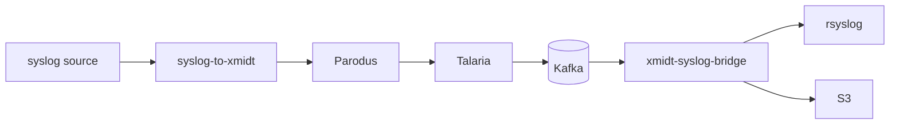

# xmidt-syslog-bridge

Delivers syslog messages from RDK CPE devices to local rsyslog or an S3 bucket,
consuming WRP events from Kafka. The message bytes are carried, never parsed,
escaped, or altered.

[](https://github.com/xmidt-org/xmidt-syslog-bridge/actions/workflows/ci.yml)
[](http://codecov.io/github/xmidt-org/xmidt-syslog-bridge?branch=main)
[](https://goreportcard.com/report/github.com/xmidt-org/xmidt-syslog-bridge)
[](https://github.com/xmidt-org/xmidt-syslog-bridge/blob/main/LICENSE)
[](https://github.com/xmidt-org/xmidt-syslog-bridge/releases)

## Summary

A CPE device writes a syslog message. A small on-device service wraps it in a WRP
event and hands it to Parodus, which already holds a secure connection to the
cloud. Talaria publishes the event to Kafka. `xmidt-syslog-bridge` is the other
end: it consumes those events, recovers the original bytes, and delivers them.

The first use case is AppArmor alerts, which today stay on the device where
nobody sees them. Reusing the xmidt path means no new ports, credentials, or
agents on the device, and no new ingress on the server side.



The bridge is a carrier and a delivery agent. It never parses, validates,
reformats, escapes, or truncates the message it carries. Whatever the device's
syslog producer emitted is what arrives.

## Details

**One destination per instance.** Either syslog or S3, never both. Configuring
neither or both is a startup error. To feed both, run two instances against the
same topic under different consumer groups.

**Syslog destination.** Writes to the local rsyslog over a Unix domain datagram
socket, one datagram per message, with no syslog client API in the way — those
prepend their own PRI, timestamp and hostname, which would stamp the cloud host's
identity onto a message that already has the device's. Network syslog transports
are deliberately absent; only the Unix socket provides the backpressure the
delivery guarantee depends on.

**S3 destination.** Messages accumulate per Kafka partition and are written one
object per batch, with the object key rendered from an operator-supplied
template. Batches close on a message count, a timeout, a byte size, partition
revocation, or shutdown — whichever comes first. gzip is optional.

**Delivery is at-least-once.** An offset is committed only after delivery
succeeds, and there is no local spool — Kafka is the buffer. Duplicates are
permitted by definition. When a destination is unreachable the bridge pauses
consumption and retries with backoff rather than failing; consumer lag is the
signal to watch.

## Configuration

Minimal, for each destination. See [the design](./docs/design.md#2-configuration)
for the full surface.

```yaml
instance: bridge-01            # defaults to hostname

kafka:
  brokers: [kafka-1:9092]
  topic: apparmor-alerts
  group: xmidt-syslog-bridge

filter:
  event: apparmor

syslog:
  network: unixgram
  address: /dev/log
```

```yaml
s3:
  bucket: apparmor-archive
  region: us-east-1
  gzip: true
  key_template: >-
    {{.FlushTime.UTC.Format "2006/01/02"}}/{{.FlushTime.UTC.Format "15-04-05"}}-{{printf "%03d" .Millis}}-{{.Instance}}{{.Ext}}
  batch:
    max_count: 10000
    max_batch_timeout: 60s
    max_bytes: 67108864      # 64 MiB
```

## Running it

```
docker run \
  -v ./my-config.yml:/etc/xmidt-syslog-bridge/xmidt-syslog-bridge.yml:ro \
  -v /dev/log:/dev/log \
  -p 10080:10080 -p 9361:9361 \
  ghcr.io/xmidt-org/xmidt-syslog-bridge:latest
```

The image ships no configuration, so an unconfigured container exits
immediately naming what is missing rather than starting against a wrong
default. Configuration is read from
`/etc/xmidt-syslog-bridge/xmidt-syslog-bridge.yml`, or from fragments in
`/etc/xmidt-syslog-bridge/conf.d/`. `${VAR}` is expanded from the environment,
so secrets need not be in the file. Run with `-s` to print the resolved
configuration, annotated with where each value came from, and exit.

The `/dev/log` mount is needed only for the syslog destination; the S3
destination needs no mount. On a host with SELinux enforcing, bind mounts need
the `:Z` suffix or the container cannot read them.

## Operating notes

Two behaviors that will surprise you if you meet them first in production.

**Raise rsyslog's `maxMessageSize`.** It defaults to 8 KB and silently discards
the remainder of anything longer. The bridge writes the full message and cannot
observe the truncation, so byte-identical delivery holds only up to whatever the
receiving daemon is configured to accept. Set it to cover your largest expected
message.

**S3 objects can overlap.** A crash with an open batch replays those messages
into a new object whose contents overlap the previous one, and the replayed
messages carry the flush time of the replay rather than of their original
capture. Anything consuming the bucket must tolerate duplicate lines.

**A config file the process cannot read is silently ignored.** goschtalt skips
it and falls through to built-in defaults, so the failure surfaces later as a
missing setting rather than as a permissions problem. If a value you set is not
taking effect, run with `-s` and check the file is listed.

**Don't add a destination check to the health endpoint.** During an outage every
instance is equally unable to write, so a probe that failed would restart-loop
the whole consumer group and add a rebalance storm to an outage no restart can
fix. Destination trouble surfaces through metrics instead.

## Documentation

| Document | What it covers |
|---|---|
| [`docs/protocol.md`](./docs/protocol.md) | The wire contract — WRP envelope, compression rule, Kafka encoding, and what each end must do |
| [`docs/design.md`](./docs/design.md) | How this component is put together, its configuration surface, and what it reports |
| [`CONTEXT.md`](./CONTEXT.md) | The vocabulary. Terms are used precisely; start here |
| [`docs/adr/`](./docs/adr/) | Why each decision was made, including the ones that look wrong until you read them |
| [`docs/user-story.md`](./docs/user-story.md) | The acceptance criteria this is built against |

The device-side component, `syslog-to-xmidt`, lives in its own repository.

## Install

Add details here.

## Contributing

Refer to [CONTRIBUTING.md](CONTRIBUTING.md).
