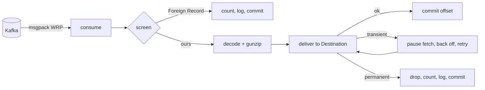

<!-- SPDX-FileCopyrightText: 2026 Comcast Cable Communications Management, LLC -->
<!-- SPDX-License-Identifier: Apache-2.0 -->
# xmidt-syslog-bridge design

The shape of the component: how it is put together, what it exposes as
configuration, and what it reports. Rationale for the decisions below lives in
[the ADRs](./adr/); this document says *what*, and links to *why*.

Read [`CONTEXT.md`](../CONTEXT.md) first — the capitalized terms here are
defined there and used precisely. The wire contract this component implements is
[`protocol.md`](./protocol.md).

## 1. Shape

One instance runs one pipeline: consume, screen, recover, deliver, acknowledge.



Three properties follow from that diagram and matter more than the boxes:

- **Nothing is acknowledged before it is delivered.** The offset commit is the
  last step, always ([ADR 0001](./adr/0001-no-local-spool.md)).
- **A stuck **Destination** stops the pipeline rather than failing it.** The
  fetch is paused for the duration, which is what keeps an outage from
  accumulating records in memory
  ([ADR 0006](./adr/0006-pause-consumption-on-destination-failure.md)).
- **Nothing that arrives can wedge it.** Every path out of `screen` and `deliver`
  ends in a commit or a bounded retry, so no single record halts a partition
  ([ADR 0004](./adr/0004-retry-transient-drop-permanent.md)).

Exactly one **Destination** is active per instance. Configuring zero or two is a
startup error. To feed both, run two instances against the same topic under
different consumer groups.

## 1.1 Package layout

The work lives in a package another program can embed; the command holds only
what makes this program *this* program.

```
/                            package bridge  -- importable
  doc.go
  metrics.go   Metrics, NewMetrics(registerer)
  servers.go   Servers/Server config, NewListeners(cfg, gatherer, logger)
  (source, screening, destinations, batch engine land here)

cmd/xmidt-syslog-bridge/     package main
  main.go      assembly, signals, shutdown order, the registry
  config.go    the configuration file format and its validation
  logging.go   slog construction
```

Nothing in `package bridge` reads a configuration file, parses a flag, reaches
for a global, or depends on a container. It takes explicit arguments, and the
command translates its configuration into them. That is what keeps the batch
lifecycle testable without standing up a process.

Each type in `package bridge` takes a configuration struct and its genuine
dependencies, and nothing else. `NewListeners(cfg, gatherer, logger)` is the
shape: the gatherer is what `/metrics` serves and the logger is optional, with
a nil one discarding.

Metric *definitions* live in `package bridge` because that is what increments
them, and an embedding program should get the same observability. The
*registry* belongs to the command, since which collectors a process exposes is
the program's business. Note that `internal/` was not an option for the
metrics: a package under `internal/` cannot be imported from outside this
module, which would defeat the point of the split.

## 2. Configuration

Loaded with goschtalt, in the layout `xmidt-org/skeleton` establishes.

```yaml
# Names this instance. Defaults to hostname. Must be unique across instances
# writing to one bucket -- it is what separates their object keys.
instance: bridge-01

logging:
  level: info              # debug, info, warn, error
  encoding: json           # json or text
  output: stdout           # stdout or stderr -- never the syslog destination

# Each listener is disabled by leaving its address empty.
servers:
  health:
    address: :10080
    path: /health
  metrics:
    address: :9361
    path: /metrics
  pprof:
    address: 127.0.0.1:9999    # loopback only; omit the address to disable
    path: /debug/pprof
  shutdown_grace: 30s

kafka:
  brokers: [kafka-1:9092, kafka-2:9092]
  topic: apparmor-alerts
  group: xmidt-syslog-bridge
  # tls:
  #   enabled: true
  #   caFile: /etc/xmidt-syslog-bridge/kafka-ca.pem
  # sasl:
  #   mechanism: SCRAM-SHA-512
  #   username: bridge
  #   password: ${KAFKA_PASSWORD}

# Which records are ours. Matched against the parsed WRP locator's authority,
# never as a string prefix (protocol.md section 3.1).
filter:
  event: apparmor

# --- exactly one of the two blocks below ---

syslog:
  network: unixgram        # only value supported; see ADR 0003
  address: /dev/log

s3:
  bucket: apparmor-archive
  region: us-east-1
  # endpoint: http://localhost:9000   # MinIO or LocalStack, for tests
  gzip: true
  key_template: >-
    {{.FlushTime.UTC.Format "2006/01/02"}}/{{.FlushTime.UTC.Format "15-04-05"}}-{{printf "%03d" .Millis}}-{{.Instance}}{{.Ext}}
  batch:
    max_count: 10000
    max_batch_timeout: 60s
    max_bytes: 67108864      # 64 MiB
```

`${VAR}` is expanded from the environment anywhere in the file, so secrets stay
out of it. `-s`/`--show` prints the resolved configuration and annotates which
values the environment supplied.

The `kafka` block mirrors the key names `wrpkafka` uses on the producer side so
operators see one shape across the platform. It deliberately does **not** reuse
that library's config type, which also carries `topicMap`, `acks`, `linger` and
other producer-only keys that would be meaningless here.

The `syslog.network` / `syslog.address` pair is the standard library's dial
shape. Only `unixgram` is accepted today; keeping the shape means adding a
transport later is an enum extension rather than a redesign.

## 3. Event source

- Consumes in a consumer group with **manual offset commits**. Autocommit is
  never enabled — it would acknowledge records before they were delivered.
- Decodes the record **value** as msgpack WRP. The record key and headers are
  ignored; they are producer-side conventions, not the contract
  ([`protocol.md` §5](./protocol.md)).
- Group heartbeats continue while the fetch is paused, so a long **Destination**
  outage does not evict the member. *Verify this against franz-go's behavior
  during implementation.*

## 4. Screening

A **Foreign Record** is skipped, counted by reason, logged with its partition and
offset, and its offset committed. Four reasons:

| Reason | Detected by |
|---|---|
| `destination` | Parsed locator authority does not match `filter.event` |
| `undecodable` | Record value is not msgpack WRP |
| `empty` | Payload has zero length |
| `gunzip` | `content-encoding: gzip` present, payload does not inflate |

Because the topic is dedicated to one event, a **Foreign Record** means something
upstream is misconfigured rather than that routine filtering is working. It is
logged at **warn**, not debug.

Message type is not checked. The destination is the only gate.

## 5. Syslog Destination

Writes the **Syslog Message** bytes to a Unix domain datagram socket, one
datagram per message. No syslog client API is used; those prepend their own PRI,
timestamp and hostname, which would wrap the device's already-complete message
inside a second one stamped with the cloud host's identity
([ADR 0002](./adr/0002-raw-bytes-to-syslog-transport.md)).

Nothing is truncated here. rsyslog applies its own `global(maxMessageSize)`,
which defaults to **8 KB** and silently discards the remainder of anything
longer. The bridge cannot observe that, so raising it to cover the largest
expected message is a deployment prerequisite, and it bounds the byte-identical
promise.

## 6. S3 Destination

### 6.1 Batching

A **Batch** accumulates per Kafka partition and closes on the first of:

| Trigger | Default |
|---|---|
| `max_count` messages | 10,000 |
| `max_batch_timeout` since its first message | 60s |
| `max_bytes` accumulated, measured uncompressed | 64 MiB |
| Its partition is revoked | — |
| Graceful shutdown | — |

Per-partition scoping is what makes revocation tractable and bounds memory at
`assigned_partitions × max_bytes`. `max_bytes` is the safety bound: nothing caps
the size of an individual message, so a count-only limit lets a burst of large
messages exhaust memory, and with no spool that becomes a restart loop.

There is no separate one-object-per-message mode. `max_count: 1` is how you get
one.

On revocation the batch is flushed and committed before ownership is yielded,
under a bounded timeout. If the flush fails or times out, **nothing is
committed** — yield, and let the new owner replay. A batch must never outlive
ownership of its partition.

### 6.2 Object contents

Each **Syslog Message** followed by a newline, nothing escaped. A message
containing a newline therefore reads as two lines; that is deliberate, and
consumers account for it
([ADR 0005](./adr/0005-carrier-not-transformer.md)).

With `gzip: true` the body is gzip-compressed, `ContentEncoding: gzip` is set so
console downloads decompress, and `.Ext` resolves to `.log.gz` instead of
`.log`.

One `PutObject` per **Batch**, no multipart. `max_bytes` keeps every object far
under the single-PUT ceiling, and an atomic PUT means a reader never sees a
half-written object.

### 6.3 Object keys

The **Object Key Template** is a Go text template rendered per batch:

| Field | Type | Notes |
|---|---|---|
| `.FlushTime` | `time.Time` | Use `.UTC.Format` |
| `.Millis` | `int` | 0–999, the millisecond component |
| `.Count` | `int` | Messages in the batch |
| `.Instance` | `string` | The **Instance Identifier** |
| `.Ext` | `string` | `.log` or `.log.gz`, from `gzip` |

`.Millis` exists because Go's `Format` only reads digits as fractional seconds
after a `.` or `,` — a layout of `15-04-05-000` renders the literal `000`, not
milliseconds.

**Flush timestamps are unique per instance.** The instance records the last one
it used and, if the next is not strictly greater, advances it by 1 ms. Without
this, two partitions closing in the same millisecond render the same key, and an
S3 `PUT` overwrites silently — the one failure worse than the duplicates the
design already tolerates.

A malformed template fails at **startup**, not on first flush.

Kafka partition and offsets are not template fields. They travel as object
metadata — `partition`, `first-offset`, `last-offset`, `count` — where they
answer reconciliation questions without dictating folder structure.

### 6.4 What a consumer of the bucket must tolerate

A crash with an open batch replays those messages into a **new** object whose
contents overlap the previous one. Objects may therefore duplicate content, and
a replayed message is written under the flush time of its *replay*, not of its
original capture.

## 7. Failure handling

| Class | Example | Response |
|---|---|---|
| **Transient** | rsyslog restarted (`ECONNREFUSED`), queue full (`EAGAIN`), S3 5xx or throttling | Pause the fetch, retry with backoff indefinitely, commit nothing |
| **Permanent** | Datagram exceeds what the socket will ever accept (`EMSGSIZE`) | Drop as a **Permanently Undeliverable Message**: count, log at error with partition, offset and size, commit |

The rule is *retry what can succeed later, drop what never can*. Retrying a
permanent failure forever would block its partition indefinitely and stall every
device behind it ([ADR 0004](./adr/0004-retry-transient-drop-permanent.md)).

One retry-and-backoff component serves both **Destinations**; the classification
of an error is destination-specific, the response to it is not.

## 8. Observability

### 8.1 Metrics

| Metric | Labels |
|---|---|
| records consumed | — |
| **Foreign Records** skipped | `reason` |
| messages delivered | `destination` |
| write errors | `class` (transient, permanent) |
| **Permanently Undeliverable Messages** dropped | — |
| batch size (histogram) | — |
| batch age (histogram) | — |
| batches flushed | `trigger` |
| seconds since last successful write | — |
| consumer lag | `partition` |

### 8.2 Health

- **Liveness** reports that the process is up and its consume loop is not
  wedged. It **must not** depend on **Destination** reachability. During an
  outage every instance in the group is equally unable to write, so a probe that
  failed would restart-loop the whole group and add a rebalance storm to an
  outage no restart can fix
  ([ADR 0006](./adr/0006-pause-consumption-on-destination-failure.md)).
- **Readiness** is "started and assigned partitions." Nothing about the
  **Destination**. There is no inbound traffic, so readiness gates nothing here
  anyway.
- **Destination** trouble pages a human through write errors, seconds since last
  successful write, and consumer lag — signals that do not carry a kill switch.

Adding a destination probe to the health endpoint looks like an improvement and
is not.

### 8.3 Logging

Own logs go to stdout only, configured by this service's own configuration.
They are never written to the **Syslog Destination**: with a local `/dev/log`
that is a feedback loop, where a delivery error logs a message that is itself
delivered.

## 9. Technology

The dependency list is deliberately short. This service reads from Kafka,
writes to a destination, and reports metrics and logs; anything beyond that
earns its place or is left out.

| Concern | Choice | Note |
|---|---|---|
| Wiring | explicit, no DI container | The graph is small and linear, and the shutdown order is the highest-stakes sequence here, so it is written out to be read ([ADR 0007](./adr/0007-explicit-wiring-no-di-container.md)). |
| Kafka client | `franz-go` | Same client `wrpkafka` produces with. That library is publish-only — it has no consumer API — so the bridge uses franz-go directly. |
| WRP codec | `wrp-go/v5` | Also supplies the locator parsing that §4 screening depends on. |
| S3 client | AWS SDK for Go v2 | Default credential chain; `endpoint` override exists so tests can target MinIO. |
| Config | goschtalt | Per `xmidt-org/skeleton`. Keys are `two_words`, so a Go field `MaxBatchTimeout` is `max_batch_timeout` in YAML. |
| CLI | kong | ditto |
| Logging | `log/slog` | Standard library. Logging here is lifecycle and warnings, not a hot path, so a faster logger buys nothing a dependency costs. |
| Metrics | `prometheus/client_golang` | Used directly, against an explicit registry that is passed where it is needed. |
| HTTP | `net/http` | Three static paths on `ServeMux`. A router would be weight without work. |

Notably absent, and deliberately: uber fx, arrange, sallust, touchstone,
httpaux, chi, and zap. Each was in the starting point inherited from skeleton
and each was removed once it turned out to be wrapping something the standard
library or a single direct dependency already did.

## 10. Testing

- Unit tests use fakes for the **Event Source** and **Destination** interfaces,
  so batch lifecycle is testable without containers.
- Integration tests use testcontainers for Kafka, MinIO for the **S3
  Destination**, and a fake `unixgram` listener that records raw bytes for the
  **Syslog Destination**.
- The tests that define done: byte-identical delivery under and over 1 KB;
  kill-with-open-batch replays; a **Foreign Record** does not block its
  partition; zero or two **Destinations** fails at startup; two batches closing
  in the same millisecond produce distinct keys.
