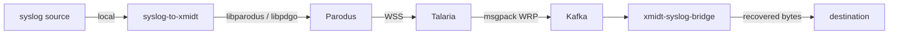

<!-- SPDX-FileCopyrightText: 2026 Comcast Cable Communications Management, LLC -->
<!-- SPDX-License-Identifier: Apache-2.0 -->
# Syslog over WRP: Wire Protocol

How a syslog message captured on an RDK CPE device is carried to a cloud
consumer over the existing xmidt path, and what each end must do with it.

This document owns the contract **between** the two components and nothing else.
What a device does with its local syslog sources, and what a consumer does with
a message once delivered, are internal to those components and are specified in
their own repositories.

The key words MUST, MUST NOT, SHOULD, and MAY are to be interpreted as described
in RFC 2119.

## 1. Participants

| Participant | Runs on | Role in this protocol |
|---|---|---|
| **syslog-to-xmidt** | CPE device | Wraps each syslog message in a WRP event and hands it to Parodus |
| **xmidt-syslog-bridge** | Server/cloud | Consumes those events from Kafka and recovers the original message |



Only the `dev → Parodus → Talaria → Kafka → bridge` span is this protocol. The
hops on either end are component-internal.

## 2. The carried message

The unit carried by this protocol is a **syslog message**: the opaque bytes a
device's syslog producer emitted, as it emitted them.

- No participant MUST parse, validate, reformat, escape, truncate, or otherwise
  alter the syslog message.
- Participants MUST NOT assume the message is valid syslog, is text, is UTF-8,
  or is free of newlines or NUL bytes.
- Only the final consumer interprets the syslog format. Compression under §4 is
  a transfer encoding and is reversed before delivery, so it is not an
  alteration.

This is the whole point of the protocol. A participant that improves the message
has broken it.

## 3. WRP envelope

Each syslog message is carried in exactly one WRP SimpleEvent. One message per
event; events MUST NOT be coalesced.

| WRP field | Value |
|---|---|
| `msg_type` | `4` (SimpleEvent) |
| `dest` | `event:<event-name>/<class>/mac:<device_mac>/<unix_timestamp>` |
| `source` | `mac:<device_mac>/<service-name>` |
| `content_type` | `application/octet-stream` |
| `headers` | `["content-encoding: gzip"]`, only when §4 applies |
| `payload` | The syslog message bytes, per §4 |
| `qos` | `90` |

For AppArmor alerts the event name is `apparmor`, the class is `alert`, and the
service name is `apparmor-forwarder`, giving a destination of
`event:apparmor/alert/mac:001122334455/1709568000`.

- `<device_mac>` MUST be 12 lowercase hex digits with no separators.
- `<unix_timestamp>` MUST be the Unix epoch second at which the sender received
  the message. It is provenance, not identity: it is not unique, and a receiver
  MUST NOT treat it as a message identifier or use it for ordering.

### 3.1 How a receiver reads the destination

A receiver MUST parse `dest` as a WRP locator and match on its structured
fields, not by string comparison against a prefix. Under the WRP locator grammar
`{scheme}:{authority}/{service}/{ignored}`, the `event` scheme places everything
after the authority into the ignored portion, so the example above parses as:

| Field | Value |
|---|---|
| `Scheme` | `event` |
| `Authority` | `apparmor` — the event name, and the only field a receiver filters on |
| `Ignored` | `/alert/mac:001122334455/1709568000` |

Parsing normalizes case and surrounding whitespace; a prefix comparison does
not, and will silently reject conforming messages. A receiver MUST NOT filter on
`msg_type` — the destination is the only gate.

## 4. Payload compression

Compression is decided by payload size alone.

- A payload larger than **1024 bytes** MUST be gzip-compressed, and the event
  MUST carry the header `content-encoding: gzip`.
- A payload of 1024 bytes or smaller MUST be sent uncompressed, and the
  `content-encoding` header MUST be absent.
- A receiver MUST gunzip when the header is present and MUST NOT attempt to
  detect compression by sniffing the payload.

The result after decompression MUST be byte-identical to what the sender
received.

**Why 1 KB:** below it, gzip's header and dictionary usually cancel the saving,
and the CPU cost is not justified on constrained CPE hardware.

## 5. Kafka encoding

Talaria publishes each WRP event to Kafka.

- The record **value** MUST be the WRP message encoded as msgpack. There is no
  additional envelope.
- A consumer MUST decode the value and MUST NOT depend on the record **key** or
  record **headers**. Both are producer-side conventions: the key is typically
  the device id for partition affinity, and headers are operator-configured
  projections of WRP fields. Either may change without notice; the value is the
  contract.
- Topic routing is a deployment concern. A topic MAY be dedicated to one event
  name or carry many, so a consumer MUST apply §3.1 filtering regardless.

## 6. Receiver behavior

### 6.1 Conforming events

A receiver MUST recover the syslog message by decoding the WRP value, gunzipping
per §4, and delivering the payload bytes unaltered.

### 6.2 Non-conforming records

A record is **foreign** when its destination does not match per §3.1, it does not
decode as WRP, its payload is empty, or it declares gzip but does not gunzip.

- A receiver MUST skip a foreign record and continue.
- A receiver MUST NOT stall, retry indefinitely, or halt its partition on one.
  A single malformed record MUST NOT delay the records behind it.
- A receiver SHOULD count foreign records by reason and log them with enough
  detail to locate the record, since on a dedicated topic a foreign record
  means something upstream is misconfigured.

## 7. Delivery semantics

Delivery is **at-least-once**.

- A receiver MUST NOT acknowledge an event to Kafka until it has delivered the
  message, so that a crash replays rather than loses.
- Duplicates are permitted by definition and consumers MUST tolerate them. The
  protocol carries no message identifier and no deduplication mechanism; the
  timestamp in `dest` is unsuitable for the purpose per §3.
- Ordering is guaranteed only within a Kafka partition. A consumer MUST NOT
  assume global ordering, and MUST NOT assume the order of delivery matches the
  order of capture on the device.
- A sender's durability across its own restarts, and a receiver's handling of a
  message it can never deliver, are component concerns rather than protocol
  ones, and are specified in their own repositories.

## 8. Examples

A 2048-byte syslog message received at Unix time 1709568000 from device
`001122334455`:

```
msg_type:     4 (SimpleEvent)
dest:         "event:apparmor/alert/mac:001122334455/1709568000"
source:       "mac:001122334455/apparmor-forwarder"
content_type: "application/octet-stream"
headers:      ["content-encoding: gzip"]
payload:      <gzip compressed syslog bytes>
qos:          90
```

The same, 500 bytes — under the threshold, so uncompressed and no header:

```
msg_type:     4 (SimpleEvent)
dest:         "event:apparmor/alert/mac:001122334455/1709568000"
source:       "mac:001122334455/apparmor-forwarder"
content_type: "application/octet-stream"
payload:      <raw syslog bytes>
qos:          90
```

## 9. Extending beyond AppArmor

Nothing in §2 through §7 is specific to AppArmor; only the event name, class,
and service name in §3 are. Carrying another kind of syslog message is a matter
of choosing a different event name and configuring receivers to filter for it.
AppArmor is simply the first use case to ship.

## 10. Document metadata

|                  |                                    |
| ---------------- | ---------------------------------- |
| **Author**       | Weston Schmidt                     |
| **Organization** | Comcast Device Management Services |
| **Status**       | Proposed                           |
| **Version**      | 2.0                                |
| **Date**         | 2026-09-18                         |

Version 2.0 narrows this document to the wire protocol. Version 1.0 was a system
specification that also covered each component's internals; those sections now
live with their components.
